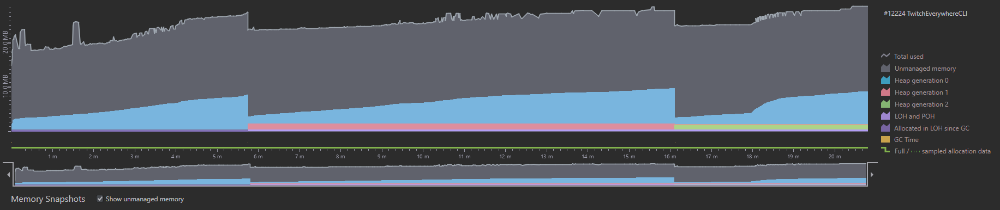
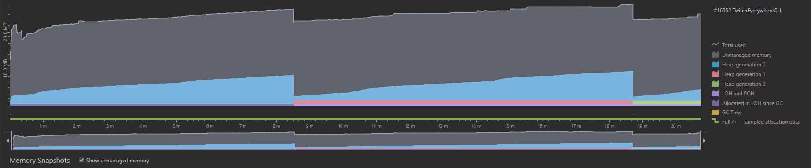
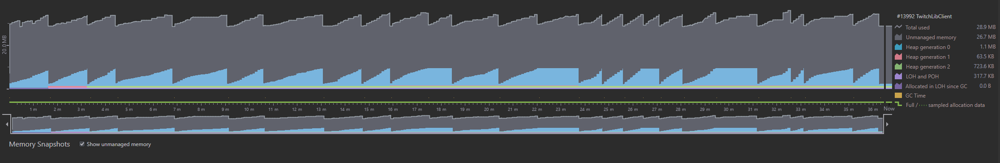
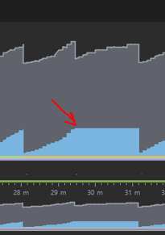
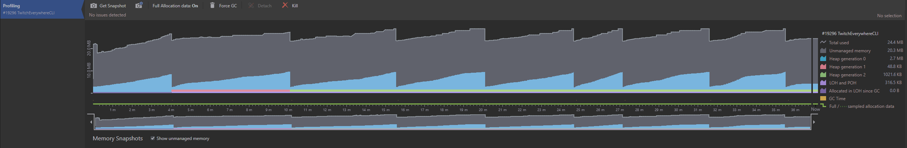

# Benchmarks
**Disclaimer:** I am not an expert in profiling and the document is an attempt by me to try and provide some data to give you an idea of how this library performs.
Its likely I will make a mistake so if you notice one please make an issue or a PR and we can get it fixed. Thanks for your understanding 🙂.

<!-- TOC -->
* [General](#general)
* [Memory Usage Profiling](#memory-usage-profiling)
* [TwitchEverywhere vs. TwitchLib.Client](#twitcheverywhere-vs-twitchlibclient)
  * [TwitchLib.Client](#twitchlibclient)
    * [Memory Usage Spikes](#memory-usage-spikes)
    * [Garbage Collection Frequency](#garbage-collection-frequency)
  * [TwitchEverywhere.CLI](#twitcheverywherecli)
<!-- TOC -->

## General
The benchmarks in the [TwitchEverywhere.Benchmark](https://github.com/pureooze/TwitchEverywhere/tree/main/TwitchEverywhere.Benchmark) project use the [BenchmarkDotNet](https://github.com/dotnet/BenchmarkDotNet/tree/master) library. You can read more about the methodology that BenchmarkDotNet uses [here](https://github.com/dotnet/BenchmarkDotNet/tree/master#features).

We send 500 messages of each type to `TwitchEverywhere` and run it several times to determine an average. The results are below:

| Method                   | Iterations |      Mean |      Error |     StdDev |    Allocated |
|--------------------------|------------|----------:|-----------:|-----------:|-------------:|
| `UserNoticeMessage`      | `500`      | `6.291 s` | `0.0400 s` | `0.0375 s` | `1740.00 KB` |
| `PrivMsg`                | `500`      | `7.548 s` | `0.1517 s` | `0.4473 s` | `1693.96 KB` |
| `UserStateMsg`           | `500`      | `7.909 s` | `0.0120 s` | `0.0112 s` | `1160.00 KB` |
| `WhisperMessage`         | `500`      | `7.636 s` | `0.1504 s` | `0.3003 s` | `1080.00 KB` |
| `GlobalUserStateMessage` | `500`      | `7.370 s` | `0.1589 s` | `0.4686 s` |  `951.70 KB` |
| `RoomStateMessage`       | `500`      | `7.891 s` | `0.0147 s` | `0.0130 s` |  `774.07 KB` |
| `ReconnectMsg`           | `500`      | `7.726 s` | `0.1534 s` | `0.4041 s` |  `754.67 KB` |
| `ClearChat`              | `500`      | `6.242 s` | `0.0269 s` | `0.0225 s` |  `718.94 KB` |
| `ClearMsg`               | `500`      | `7.232 s` | `0.1001 s` | `0.0936 s` |  `687.69 KB` |
| `NoticeMsg`              | `500`      | `6.249 s` | `0.0268 s` | `0.0251 s` |  `628.95 KB` |
| `HostTargetMsg`          | `500`      | `7.885 s` | `0.0234 s` | `0.0207 s` |  `624.19 KB` |
| `PartMsg`                | `500`      | `7.996 s` | `0.1551 s` | `0.2548 s` |  `585.02 KB` |
| `JoinMsg`                | `500`      | `7.968 s` | `0.0348 s` | `0.0326 s` |  `557.64 KB` |

## Memory Usage Profiling
Using `dotMemory Profiler` we can test how much memory `TwitchEverywhere` uses. 
The sample CLI app in the `TwitchEverywhereCLI` project is an example of a very minimal app that stores some messages in a memory buffer and occasionally writes to disk, so we can use it to for the benchmark.
The benchmark was also run against a Twitch chat with around 100,000 viewers so the chat was quite active. It was run for approximately 20 minutes and the results are here:

We can see that total memory usage does not exceed approximately 28MB but there is some Garbage Collection (GC) happening at 6m and 16m.
This could be happening for a few reasons, there might be something in `TwitchEverywhere` itself or it could be an issue with the CLI app.

Lets see what happens if we change the CLI app so it only logs messages to `STDOUT` and then stops referencing the objects.
The same test as above is run with the updated code (~100K viewers, 20 minutes):

Some observations about this change we can make:
* `Gen0` garbage collection gets deferred by ~2 minutes
  * This causes `Gen1` and `Gen2` to be deferred as well (not surprising 😉)
* Fewer spikes in memory usage, probably because we dont store in a buffer or write to disk
  * If you look closely, there are some very small spikes but they are negligible
* High traffic can cause issues with GC so clients should be careful with buffers/IO streams especially when trying to run at scale

## TwitchEverywhere vs. TwitchLib.Client
`TwitchLib.Client` is a powerful C# library that allows for interaction with various Twitch services – most notably chat and whisper. 
`TwitchLib.Client` is a very feature rich library and at the moment `TwitchEverywhere` only supports a small amount of the features and most notably does not allow sending messages. 
This gap will get closer as I add in features but its worth keeping in mind when trying to decide which library is best for your use case.

In order to do a comparison between the two libraries we can run a similar test as the previous section. 
I ran both `TwitchEverywhere.CLI` and `TwitchLib.Client` on my machine at the same time, connecting them to the same channel as well (with a small 1 second delay between starting because of IDE UI lag 🙂).
This ensures that both libraries receive the same data at the same frequency. 

The benchmark was run for about 37 minutes on a machine with a `Ryzen 5 3600X` with `32GB` of RAM. Both applications logged each message recieved to the console.
Here are the results:

### TwitchLib.Client

The results for `TwitchLib.Client` were really impressive! With a peak memory usage of ~`36.07MB` with `26.75MB` for unmanaged memory leaving a total of `9.25MB` for managed memory.
Given the amount of features the library supports as well as how many .NET frameworks it targets I was sure the memory usage was going to be higher than this.
I think the maintainers have done a great job at making it perform as well as it does – no wonder it has 233K downloads on nuget.org 🤯.

There are two things I do want to note though:

#### Memory Usage Spikes
Sometimes the memory for Gen0 would rapidly spike up, going from around 8MB to around 15MB.
But then dotMemory would suddenly rerender the gen and "flatten" the peak. Which is actually what you see here:

I'm not sure why this happened. Maybe its just a bug in how dotMemory renders.
Or it could be the Garbage Collector doing something that dotMemory isn't able to represent in this visualization.
I'm not sure as to the reason but it wasn't clear to me what happened so I think its worth mentioning. If you know what causes this, please let me know!

#### Garbage Collection Frequency
Another thing worth observing is **how often** the GC occurs. It seems that for `TwitchLib.Client` GC happened around every 1 - 2 minutes. This seems pretty frequent but its also not surprising.
The stream that was used for this had a very high amount of messages, so object creation and disposal was very frequent, causing this behavior.

But while it's necessary to have objects – when evaluating performance we should consider **when** and **how** objects are created.
When are we creating the objects? How frequently do we create them? What data do they hold? Why? When and how do we access the data?
This was something I tried to be considerate of (even with my limited perf. experience 😉) when creating `TwitchEverywhere`. 

### TwitchEverywhere.CLI

`TwitchEverywhere` had a peak memory usage of `28.91MB` with `19.50MB` for unmanaged memory leaving `9.38MB` for managed memory.
The difference in unmanaged memory is at least partly due to different build targets, since `TwitchEverywhere` targets .NET 6 and .NET 7.
While the total memory usage is similar to `TwitchLib.Client` there is a pretty stark difference in how often GC happens. 
For `TwitchEverywhere` GC happens around every 4 minutes, so around 2 - 4 times LESS frequently than `TwitchLib.Client`.

### Gen0, Gen1, Gen2, LOH and POH, Oh My!

| Segment   | `TwitchLib.CLient` | `TwitchEverywhere` |
|-----------|--------------------|--------------------|
| UnManaged | 26.75 MB           | 19.50 MB           |
| Gen0      | 8.02 MB            | 8.01 MB            |
| Gen1      | 241.3 KB           | 42.9 KB            |
| Gen2      | 723.6 KB           | 1.00 MB            |
| LOH & POH | 364.8 KB           | 363.5 KB           |
| Total     | ~36.1 MB           | ~28.92 MB          |